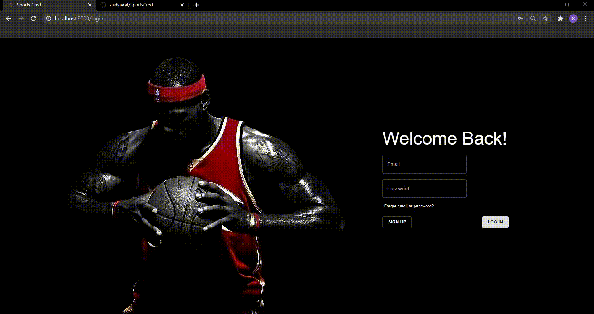
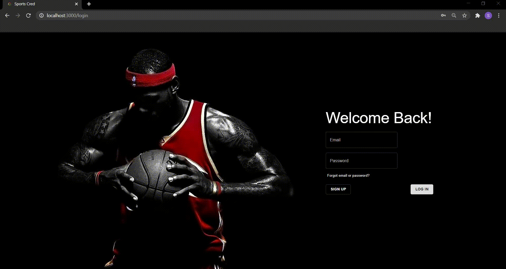
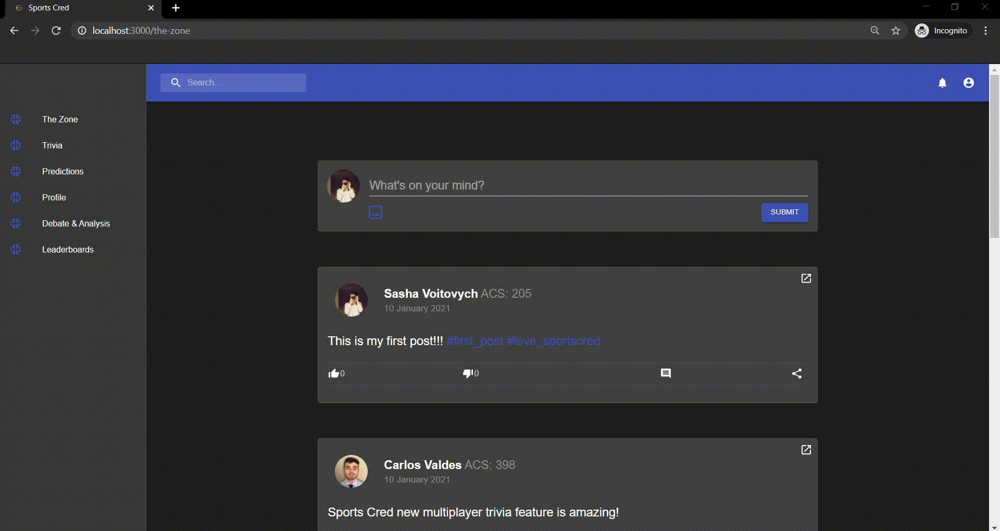
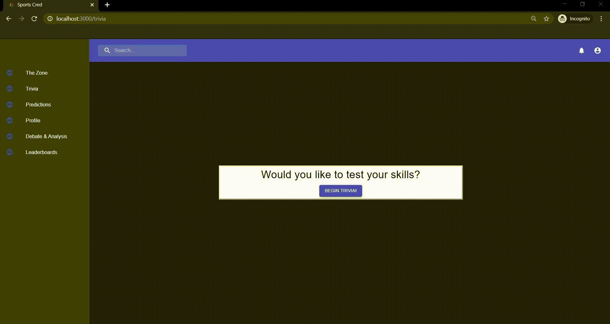
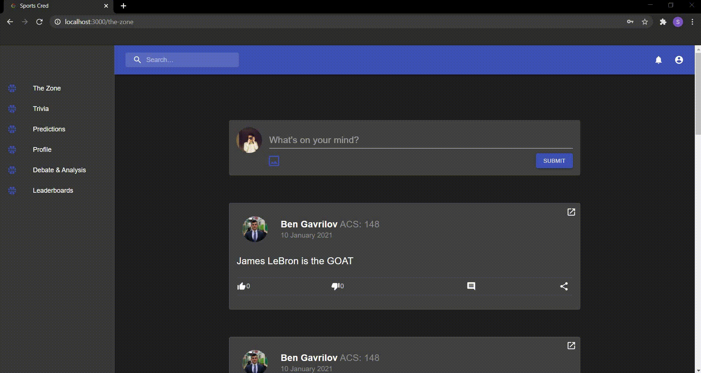

# SportsCred

Beta version of sports related social media platform written in Golang, ReactJS and using Neo4j database technology. 

# Contents

- [Installation](#installation)
- [Project development](#project-development)
- [Features](#features)
- [Credits](#credits)

# Installation

To install and run a project inside a docker container write in the terminal:

```console
foo@bar:~$ git clone https://github.com/sashavoit/SportsCred
foo@bar:~$ cd SportsCred
foo@bar:~$ sudo docker-compose up
```

# Project development

Project was developed in a team of seven while following following Agile SCRUM. Product backlog, detailed personas, UI design, system architecture and complete logs of sprint planning, sprint retrospective meetings can be found [here](/doc).

# Features

### Sign up

Anyone can sign up with new account by entering their first name, last name, email and phone number. They also can fill out optional fields about their sports interests. 



### Log in 

To access any internal functionality of SportsCred, user must login by entering their credentials. Credentials are verified with data in the database and JWT token is generated for logged in user.



### Profile

Users in SportsCred can visit other users' profile pages. Profile page contains:

- User's first and last name 
- User's ACS score that determines his level of expertise. ACS is changed when user plays single or multiplayer trivia, and making predictions on upcoming games.
- User's hisotry of open court posts
- User's hisotry of debate answers
- User's hisotry of ACS score
- User's radar (list of friends)

Users may also change their profile picture via profile


### Open court

Open court is a feed where every user can post on any topic, like, dislike or comment on other user's posts. Open court supports attaching images to post's content, and also embed posts from Facebook, Reddit and Instagram posts. Open court posts are not rated.


### Single & multiplayer trivia 

Users may play single trivia to check their knowledge. For every correct answer user's ACS increases by 1 point, and for every incorrect answer - decreases by 1 point. 



A user cannot exit trivia in the middle of the game. If done so, user recieves a penalty of 10 ACS points. 



Users may also play trivia with their friends. To do so, one sends the other user an invitation and other user accepts it.

Trivia games are synchronized through use of long polling and GoLang channels in the back-end.


### Debate & analysis

Users may participate in everyday debates. After user answers a promt, he may rate other users' answers on the scale from disagree (0) to agree (100). To exclude bias while rating, authors of answers are kept anonumous until rating is finilized.


### Picks & predictions

Users can make predictions on upcoming basketball matches. Every correct prediction is worth 1 point, for incorrect 1 point is deducted.

After game occurs, the notifications are sent to all users that predicted the outcome.


### Leaderboards

Users may see how they rank compared to user users in general, or tier-based leaderboards.



### Unified search

Every page contains a unified search bar, where users can search for users or posts by keywords, or by hashtags.


# Credits

Project was developed as part of CSCC01 Introduction to Software Engineering course at University of Toronto in a team of seven developers:

- [Kyle Song](https://github.com/KylSong)
- [Ben Gavrilov](https://github.com/bengavrilov)
- [Yifei Gao](https://github.com/YifeiGao)
- [Kevin Zhu](https://github.com/kaiwen-z)
- [Wisam Mohiuddin](https://github.com/wisam-m)
- [Anand Karki](https://github.com/karkonium)
- Sasha Voitovych (me)
